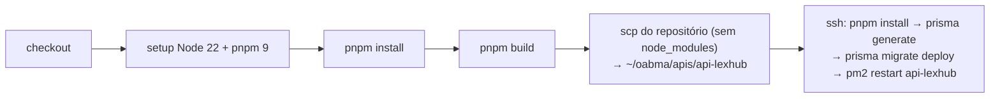

# Ambiente, execução e deploy

## Pré-requisitos

- Node.js 22 (versão usada no CI)
- pnpm (CI usa a versão 9)
- Docker (para o PostgreSQL local)

## Variáveis de ambiente

Copie `.env.example` para `.env`. Todas são validadas na inicialização
(`src/http/_env/index.ts`) — se alguma estiver inválida o processo não sobe.

| Variável | Obrigatória | Padrão | Descrição |
|---|:-:|---|---|
| `NODE_ENV` | | `development` | `development` \| `production`. Em produção: cookie `secure`, e-mails para o destinatário real, sem log de queries |
| `PORT` | | `3892` | Porta HTTP |
| `DATABASE_URL` | ✅ | | URL do PostgreSQL |
| `EMAIL_ADMIN_FULL` | ✅ | | E-mail do administrador criado pelo seed |
| `PASSWORD_ADMIN_FULL` | ✅ | | Senha (mín. 8) do administrador do seed |
| `JWT_SECRET` | ✅ | | Segredo HMAC do JWT (mín. 8; use um valor longo e aleatório) |
| `RESEND_API_KEY` | ✅ | | Chave da API Resend |
| `WEB_URL` | ✅ | | URL do frontend — origem CORS e base dos links nos e-mails |
| `DOMAIN` | | `localhost` | Domínio do cookie `@lexhub-auth` |
| `API_PROTHEUS_DATA_URL` | ✅ | | Base da API de dados cadastrais do Protheus |
| `API_PROTHEUS_FIN_URL` | ✅ | | Base da API financeira do Protheus |

## Rodando localmente

```bash
pnpm install
docker compose up -d                 # PostgreSQL 17 (docker-compose.yml é local e ignorado pelo git;
                                     # use docker-compose-example.yml como base)
pnpm prisma migrate dev              # aplica as migrations
pnpm prisma db seed                  # cria o administrador inicial
pnpm dev                             # tsx watch src/http/server.ts
```

- API: `http://localhost:3892` · Swagger: `http://localhost:3892/docs`
- `pnpm prisma studio` abre um visualizador do banco.

## Scripts (`package.json`)

| Script | Comando | Uso |
|---|---|---|
| `dev` | `tsx watch src/http/server.ts` | Desenvolvimento com reload |
| `build` | `tsup` | Gera `build/` (ESM transpilado, com sourcemap). **Não faz typecheck** |
| `start` | `node build/http/server.js` | Produção |
| seed | `tsx prisma/seed` | Via `pnpm prisma db seed` |

Checagens manuais recomendadas antes de subir (não há scripts para isso ainda):

```bash
pnpm tsc --noEmit       # typecheck
pnpm biome check src    # lint + formatação
```

## CI/CD — `.github/workflows/main.yml`

Disparado em **push** e **pull_request** para `main`:



Secrets necessários no GitHub: `SSH_HOST`, `SSH_USER`, `SSH_KEY`, `SSH_PORT`.

Pontos de atenção:

- O `.env` de produção fica **só no servidor** (não é copiado pelo CI).
- As migrations são aplicadas automaticamente a cada deploy (`migrate deploy`).
- O processo em produção roda no **pm2** com o nome `api-lexhub`, atrás do NGINX da OAB.
- O job também roda em `pull_request`, o que dispara deploy a partir de PRs ([DT-31](debitos-tecnicos.md#dt-31)).
- Não há etapa de lint, typecheck ou testes.

## Operação

| Tarefa | Comando (no servidor) |
|---|---|
| Ver logs | `pm2 logs api-lexhub` |
| Reiniciar | `pm2 restart api-lexhub` |
| Status | `pm2 status` |
| Aplicar migrations manualmente | `pnpm prisma migrate deploy` |
| Criar/garantir admin | `pnpm prisma db seed` |

Não existe endpoint de healthcheck ([DT-34](debitos-tecnicos.md#dt-34)).
