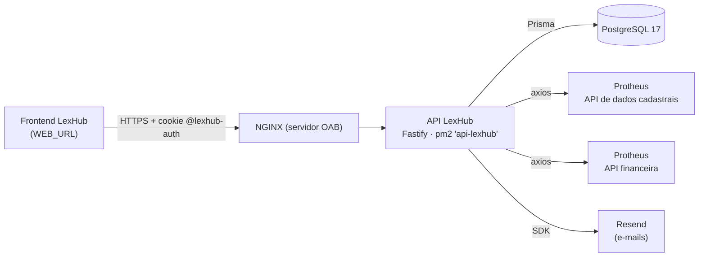
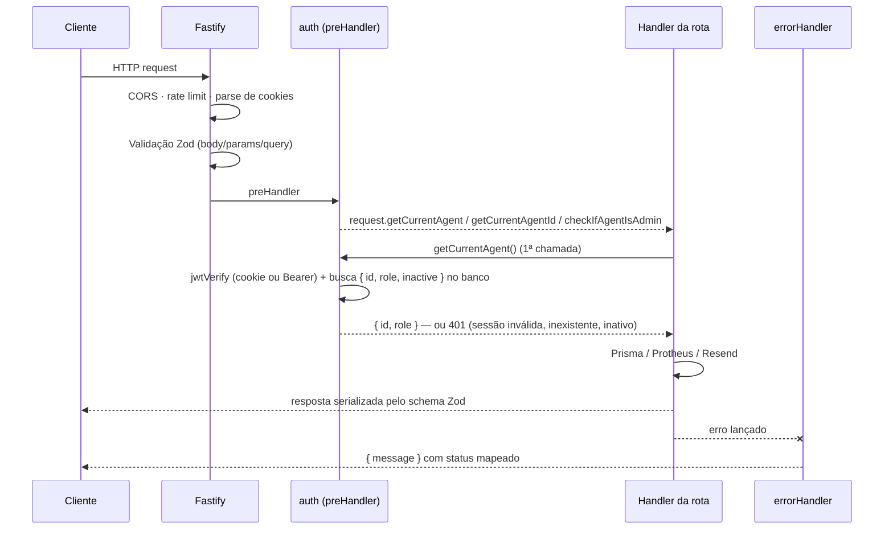

# Arquitetura

## Visão geral

A API LexHub ("OAB Atende") é um monólito HTTP em **Fastify 5 + TypeScript** que
serve o frontend web do LexHub. Ela persiste dados em **PostgreSQL** via **Prisma**,
consulta o ERP **TOTVS Protheus** para dados de advogados e adimplência, e envia
e-mails transacionais pelo **Resend**.



## Stack

| Camada | Tecnologia |
|---|---|
| Runtime | Node.js 22 (CI), TypeScript 5 (`module`/`moduleResolution: node16`, `strict`) |
| HTTP | Fastify 5, `fastify-type-provider-zod` 4, Zod 3 |
| Plugins | `@fastify/jwt`, `@fastify/cookie`, `@fastify/cors`, `@fastify/rate-limit`, `@fastify/swagger`, `@fastify/swagger-ui` |
| Banco | PostgreSQL 17, Prisma 6 (`prisma-client-js`) |
| Integrações | axios (Protheus), Resend + `@react-email/components` (e-mails em TSX) |
| Utilitários | dayjs (datas), bcryptjs (hash de senha) |
| Build / Dev | tsup (saída `build/`), tsx watch, pnpm |
| Qualidade | Biome 1.9 (formatação + lint no editor); **sem testes automatizados** |

## Estrutura de pastas

```
api-lexhub/
├── prisma/
│   ├── schema.prisma          # Modelo de dados
│   ├── migrations/            # Migrations versionadas (aplicadas no deploy)
│   └── seed/index.ts          # Cria o administrador inicial
├── src/
│   ├── http/
│   │   ├── server.ts          # Ponto de entrada: app.listen()
│   │   ├── app.ts             # Instância Fastify + plugins + errorHandler
│   │   ├── routes/index.ts    # Registro de todas as rotas
│   │   ├── core/
│   │   │   ├── agents/        # Rotas de funcionários e autenticação (1 arquivo = 1 rota)
│   │   │   ├── metrics/       # Séries, rankings e relatório PDF do dashboard
│   │   │   └── services/      # Rotas de atendimentos, tipos, advogados e totais do dashboard
│   │   ├── middlewares/auth.ts  # Plugin que injeta getCurrentAgent / getCurrentAgentId / checkIfAgentIsAdmin
│   │   ├── _env/index.ts      # Validação das variáveis de ambiente (Zod)
│   │   ├── _errors/           # Classes de erro (400/401/403/404/409/422) e errorHandler
│   │   └── _types/fastify.d.ts  # Augment de FastifyRequest
│   ├── lib/
│   │   ├── prisma.ts          # PrismaClient
│   │   ├── axios.ts           # Clientes API_PROTHEUS_DATA_URL e API_PROTHEUS_FIN_URL
│   │   ├── dayjs.ts           # dayjs com utc/timezone e o fuso fixo America/Fortaleza
│   │   └── resend.ts          # Cliente Resend
│   └── utils/
│       ├── emails/            # Templates React Email (boas-vindas, redefinição de senha)
│       ├── metrics/           # Períodos no fuso local, consultas agregadas e schemas de período
│       ├── reports/           # Relatório de atendimentos em PDF (pdfkit) e logo embutida
│       └── generate-recovery-code.ts
├── openspec/                  # Specs (comportamento) e changes (propostas) — ver docs/README.md
├── docs/                      # Esta documentação
└── .github/workflows/main.yml # CI/CD
```

> Os imports usam `baseUrl: ./src` do `tsconfig.json` (ex.: `import { prisma } from 'lib/prisma'`).
> O alias `@/*` declarado em `paths` não é usado (e aponta para `src/src/*`). Ver [DT-32](debitos-tecnicos.md#dt-32).

## Padrão de uma rota

Cada rota é um plugin Fastify isolado, registrado em `src/http/routes/index.ts`:

```ts
export async function finishedService(app: FastifyInstance) {
  app
    .withTypeProvider<ZodTypeProvider>()
    .register(auth)                       // injeta os helpers de autenticação
    .patch('/services/finished/:id', {
      schema: {                           // Zod → validação + serialização + OpenAPI
        tags: ['services'],
        summary: 'Finalizar um atendimento',
        security: [{ bearerAuth: [] }],
        params: z.object({ id: z.string().uuid() }),
        response: { 204: z.null() },
      },
    }, async (request, reply) => {
      const agent = await request.getCurrentAgent()  // ou getCurrentAgentId() / checkIfAgentIsAdmin()
      // ... regra de negócio com prisma; erros de domínio com NotFoundError, ForbiddenError...
      return reply.status(204).send()
    })
}
```

Não há camadas de serviço/repositório: a regra de negócio e o acesso ao banco
ficam dentro do handler da rota.

## Ciclo de uma requisição



## Autenticação e autorização

- **Login** (`POST /agents/sessions`) gera um JWT `{ sub: agentId, role }` com validade de **1 dia**,
  devolvido no corpo (`{ token }`) e no cookie `@lexhub-auth` (`httpOnly`, `sameSite=lax`,
  `domain=DOMAIN`, `secure` em produção).
- O plugin `@fastify/jwt` está configurado para ler o token do **cookie** `@lexhub-auth`
  ou do header **`Authorization: Bearer`**.
- `src/http/middlewares/auth.ts` adiciona três helpers à requisição:
  - `getCurrentAgent()` — valida o JWT, busca o funcionário pelo `sub` e retorna `{ id, role }`.
    Recusa com `401` se o token for inválido ou expirado, se o funcionário não existir ou se estiver
    **inativo** (inativação vale na hora). O resultado fica guardado: a requisição faz no máximo
    **uma** consulta, mesmo chamando vários helpers.
  - `getCurrentAgentId()` — atalho para o `id` de `getCurrentAgent()`.
  - `checkIfAgentIsAdmin()` — usa `getCurrentAgent()` e responde `403` se o papel **do banco**
    (não o do JWT) for diferente de `ADMIN`.
- Papéis: `ADMIN` (gestão de funcionários e catálogo de tipos) e `MEMBER` (operação de atendimentos).
  Finalizar/cancelar atendimento: só o funcionário que o registrou ou um `ADMIN`.
- A autenticação é *opt-in* por rota: rotas sem a chamada a um dos helpers são públicas
  (login, logout, recuperação e redefinição de senha).
- O **logout** é público e idempotente: sempre limpa o cookie, mesmo com o token expirado.

Matriz completa de permissões em [api.md](api.md#matriz-de-permissões).

## Tratamento de erros

Definido em `src/http/_errors/index.ts`. As rotas lançam as classes de erro de
`src/http/_errors/` e o handler global converte, nesta ordem:

| Erro | Status | Uso |
|---|---|---|
| Validação do Fastify / `ZodError` | 400 | corpo, params ou query fora do schema |
| `BadRequestError` | 400 | dado enviado inválido (ex.: tipo de serviço inexistente no corpo) |
| `UnauthorizedError` | 401 | **somente** o middleware: sessão inválida, funcionário inexistente ou inativo |
| `ForbiddenError` | 403 | autenticado, mas sem permissão |
| `NotFoundError` | 404 | recurso do caminho (`:id`) não existe |
| `ConflictError` | 409 | duplicidade ou estado incompatível (ex.: atendimento já finalizado) |
| `UnprocessableEntityError` | 422 | regra de negócio impede a operação (ex.: advogado inadimplente) |
| `BadGatewayError` | 502 (logado com `console.error`) | provedor externo recusou a operação (ex.: envio de e-mail pelo Resend) |
| Rate limit | 429 | |
| `AxiosError` (qualquer falha do Protheus) | 404 | |
| Demais | 500 (logado com `console.error`) | falhas inesperadas, inclusive do banco |

O corpo é sempre `{ message: string }` (mais `errors` no caso de `ZodError`).
Como o `401` significa apenas "sessão encerrada", o frontend pode tratá-lo de forma
global (voltar ao login) sem deslogar o usuário em erros de negócio.

## Configuração transversal

| Item | Valor atual |
|---|---|
| Porta | `PORT` (padrão 3892), host `0.0.0.0` |
| CORS | origem única `WEB_URL`, `credentials: true` |
| Rate limit | 1000 req/min por IP (`@fastify/rate-limit`), sem `trustProxy` |
| OpenAPI | Swagger UI em `/docs`, esquema `bearerAuth` |
| Logger do Fastify | desabilitado; Prisma loga queries em `development` |
