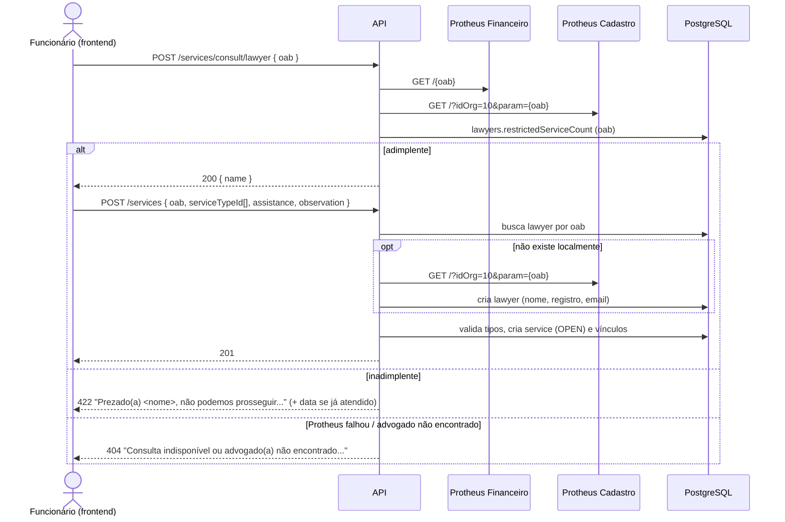
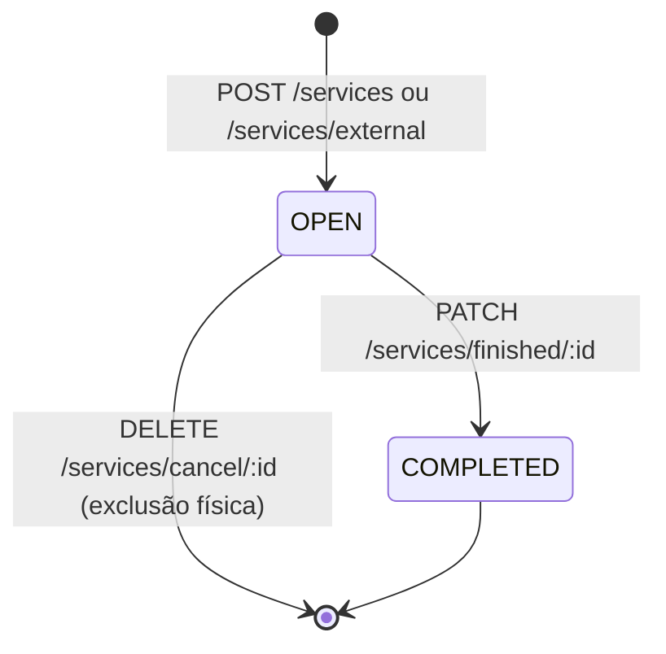
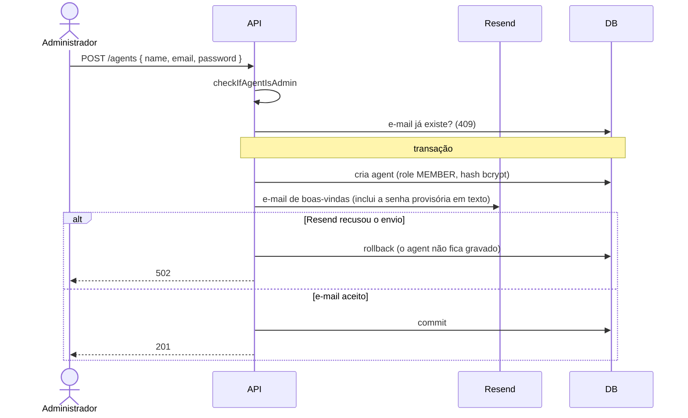
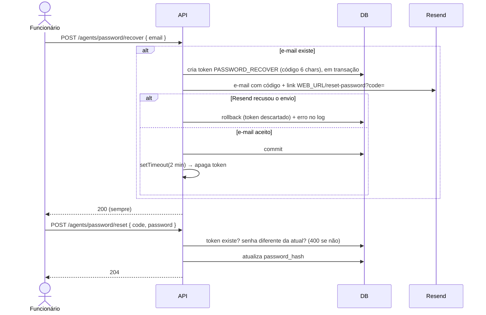

# Fluxos de negócio

Glossário: **agent** = funcionário da OAB que usa o sistema · **lawyer** = advogado(a)
atendido(a) · **service** = atendimento · **service type** = tipo de serviço prestado ·
**adimplente/inadimplente** = em dia / em débito com a OAB (segundo o Protheus).

## 1. Registro de um atendimento

O fluxo abaixo combina o que a API faz com o que o frontend precisa fazer.
A API **não** encadeia a consulta de adimplência com a criação — a ordem depende do frontend.

A inadimplência responde `422` (regra de negócio sobre o advogado), não `401`: a
sessão do funcionário continua válida.

Depois de criado, o atendimento aparece em `GET /services/all` como `OPEN` e pode ser:

- **finalizado** — `PATCH /services/finished/:id` → `COMPLETED` + `finishedAt`;
- **cancelado** — `DELETE /services/cancel/:id` → excluído (somente se `OPEN`).

As duas ações são permitidas só ao funcionário que registrou o atendimento ou a um
`ADMIN` (`403` para os demais), a mesma regra que o frontend usa para habilitar os botões.

## 2. Atendimento externo e "atendimento único" ao inadimplente

`POST /services/external` recebe **nome e e-mail informados pelo funcionário**. É usado:

1. quando o advogado não é encontrado no Protheus (a consulta retornou 404);
2. para conceder **um atendimento excepcional** a um advogado inadimplente
   (regra introduzida no commit `4b3deb4`, mai/2025).

O que a API faz em `POST /services/external`:

1. procura o advogado por OAB; se não existir, cria com `name`/`email` do corpo;
2. consulta `GET {API_PROTHEUS_FIN_URL}/{oab}`; se vier vazio (inadimplente),
   grava `restrictedServiceCount = now()`;
3. cria o atendimento normalmente.

Na próxima consulta (`POST /services/consult/lawyer`), se o advogado continuar
inadimplente, a mensagem de bloqueio inclui "Advogado(a) atendido(a) anteriormente em DD/MM/AAAA".

> ⚠️ **Limitação atual:** a API não impede um segundo atendimento externo a um
> inadimplente já marcado, `POST /services` não verifica adimplência e o campo
> nunca é zerado quando o advogado regulariza a situação. O "atendimento único"
> só é respeitado se o frontend seguir o fluxo. Ver [DT-10](debitos-tecnicos.md#dt-10).
>
> *Interpretação:* a intenção descrita acima foi inferida do código e das mensagens
> de commit; confirme a regra com a área de negócio antes de alterá-la.

## 3. Cadastro de funcionário

Gravação e envio são uma operação única: se o Resend recusar o e-mail, o cadastro é
desfeito; se a gravação falhar, nenhum e-mail sai (`500`).

O administrador define a senha provisória. O e-mail diz que a troca é obrigatória,
mas o sistema **não força** a troca no primeiro acesso ([DT-01](debitos-tecnicos.md#dt-01)).
Para promover a `ADMIN`, usar `PUT /agents/update/:id` com `role`.

O primeiro administrador é criado pelo seed (`pnpm prisma db seed`) com
`EMAIL_ADMIN_FULL` / `PASSWORD_ADMIN_FULL`.

## 4. Inativação de funcionário

- `PATCH /agents/inactive/:id` grava a data em `agents.inactive`; o login passa a ser recusado.
- A inativação vale **na hora**: a próxima requisição do funcionário a qualquer rota
  protegida recebe `401` com "Seu acesso foi desativado. Procure o administrador do
  sistema.", mesmo com um token emitido antes. O frontend trata o `401` como sessão
  encerrada.
- `PATCH /agents/active/:id` limpa o campo; um token ainda não expirado volta a funcionar.
- Não há exclusão de funcionários (atendimentos referenciam o agent com `RESTRICT`).

## 5. Recuperação de senha

Fora de produção o e-mail vai para um endereço fixo do desenvolvedor e o código é
impresso no console. Riscos da expiração em memória: [DT-02](debitos-tecnicos.md#dt-02).

## 6. Métricas do dashboard

Todas contam atendimentos por `createdAt`, de todos os status, com dias, meses e anos no
horário do Maranhão (`America/Fortaleza`, UTC-3), qualquer que seja o fuso do servidor:

| Indicador | Rota |
|---|---|
| Total geral | `GET /services/general` |
| Hoje × ontem | `GET /services/general/agent/day` (todos os funcionários, apesar do nome) |
| Mês atual × anterior | `GET /services/general/month` |
| Ano atual × anterior | `GET /services/general/year` |
| Por funcionário (total, mês, mês anterior) | `GET /services/general/agent/:id` |
| Gráfico Jan–Dez (legado) | `GET /services/monthly?year=` (depreciada; padrão: ano atual) |
| Série por ano | `GET /metrics/services/yearly` |
| Série por mês de um ano | `GET /metrics/services/monthly?year=` |
| Série por dia de um mês | `GET /metrics/services/daily?year=&month=` |
| Advogados(as) mais atendidos(as) | `GET /metrics/lawyers/top?year=&month=&limit=10` |
| Funcionários(as) que mais atenderam | `GET /metrics/agents/top?year=&month=&limit=3` |

Nos rankings, sem `year` e `month` vale todo o histórico. Funcionários inativos continuam
no ranking pelos atendimentos que registraram.

### Relatório para a diretoria

`GET /metrics/report?year=&month=` gera um PDF (A4) do ano ou do mês, com a identidade da
OAB-MA, quem gerou e quando, os indicadores do período, o gráfico por dia ou por mês, o top
10 de advogados(as), o top 3 de funcionários(as) e o histórico anual. Se o período ainda
está em andamento, a comparação usa o mesmo trecho do período anterior (ex.: 01/01 a 11/09
de 2025 contra 01/01 a 11/09 de 2026), para não comparar um período parcial com um completo.
Qualquer funcionário autenticado pode gerar o relatório.
