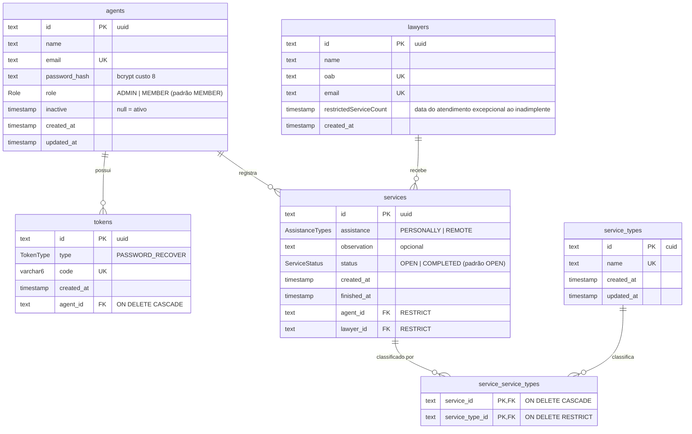

# Modelo de dados

Fonte da verdade: [`prisma/schema.prisma`](../prisma/schema.prisma). Banco PostgreSQL 17.

## Diagrama



## Entidades

### `agents` (model `Agent`) — funcionários da OAB

| Campo (Prisma → coluna) | Tipo | Regras |
|---|---|---|
| `id` | `String` uuid | PK |
| `name` | `String` | |
| `email` | `String` | único |
| `passwordHash` → `password_hash` | `String` | bcrypt |
| `role` | `Role` | `ADMIN` \| `MEMBER`, padrão `MEMBER` |
| `inactive` | `DateTime?` | preenchido = inativo (data da inativação) |
| `createdAt` / `updatedAt` | `DateTime` | `updated_at` gerenciado pelo Prisma |

### `tokens` (model `Token`) — códigos de recuperação de senha

| Campo | Tipo | Regras |
|---|---|---|
| `id` | uuid | PK |
| `type` | `TokenType` | apenas `PASSWORD_RECOVER` |
| `code` | `VarChar(6)` | único; `A-Z0-9` |
| `agentId` → `agent_id` | FK `agents` | cascade ao excluir o agent |
| `createdAt` | `DateTime` | não é usado para expiração (ver [DT-02](debitos-tecnicos.md#dt-02)) |

### `lawyers` (model `Lawyer`) — advogados atendidos (cache local do Protheus)

| Campo | Tipo | Regras |
|---|---|---|
| `id` | uuid | PK |
| `name` | `String` | |
| `oab` | `String` | único; chave de busca no Protheus |
| `email` | `String` | único |
| `restrictedServiceCount` | `DateTime?` | coluna em camelCase (sem `@map`); data do atendimento excepcional concedido a inadimplente |
| `createdAt` | `DateTime` | |

Advogados são criados sob demanda no primeiro atendimento e **nunca atualizados**
a partir do Protheus depois disso.

### `services` (model `Services`) — atendimentos

| Campo | Tipo | Regras |
|---|---|---|
| `id` | uuid | PK |
| `assistance` | `AssistanceTypes` | `PERSONALLY` (presencial) \| `REMOTE` (remoto) |
| `observation` | `String?` | |
| `status` | `ServiceStatus` | `OPEN` \| `COMPLETED`, padrão `OPEN` |
| `createdAt` → `created_at` | `DateTime` | base de todas as métricas |
| `finishedAt` → `finished_at` | `DateTime?` | preenchido ao finalizar |
| `agentId` / `lawyerId` | FK | `ON DELETE RESTRICT` |

Índices: `lawyer_id`, `agent_id`, `status` e `created_at` (base das métricas).
Cancelamento = exclusão física do registro.

### `service_types` (model `ServiceTypes`) — catálogo de tipos de serviço

| Campo | Tipo | Regras |
|---|---|---|
| `id` | `String` **cuid** | PK (difere dos demais, que usam uuid) |
| `name` | `String` | único |
| `createdAt` / `updateAt` → `updated_at` | `DateTime` | atenção ao nome do campo Prisma `updateAt` |

### `service_service_types` (model `ServiceServiceTypes`) — N:N atendimento × tipo

PK composta `(service_id, service_type_id)`. Excluir um atendimento remove os vínculos;
excluir um tipo em uso é bloqueado.

## Enums

| Enum | Valores |
|---|---|
| `Role` | `ADMIN`, `MEMBER` |
| `TokenType` | `PASSWORD_RECOVER` |
| `ServiceStatus` | `OPEN`, `COMPLETED` (a ordem define a ordenação `status asc`) |
| `AssistanceTypes` | `PERSONALLY`, `REMOTE` |

## Histórico de migrations

| Migration | Mudança |
|---|---|
| `20250210004603_initial_database_creation` | Tabelas `agents`, `tokens`, `lawyers` (com `cpf`), `services` (com `types TEXT[]`) |
| `20250211002455_added_inactive_field_in_agents` | `agents.inactive` |
| `20250216134856_adicionado_campo_code_em_tokens` | `tokens.code` único |
| `20250217235919_criado_tabela_de_relation_service_e_servicetype` | Remove `services.types`; cria `service_types` e `service_service_types`; token com cascade |
| `20250218002853_add_tipo_de_atendimento_em_services` | Enum `AssistanceTypes` + `services.assistance` |
| `20250218010651_add_createdat_e_updatedat_em_services_types` | Timestamps em `service_types` |
| `20250220000638_removido_cascade_do_service_type` | FK do tipo passa a `RESTRICT` |
| `20250226133057_adicionado_default_open_em_status` | `services.status` padrão `OPEN` |
| `20250318120726_removed_fiel_cpf_in_lawyers` | Remove `lawyers.cpf` |
| `20250522133453_add_field_restricted_service_count_table_lawyer` | `lawyers.restrictedServiceCount` |
| `20260911180000_adicionado_indice_created_at_em_services` | Índice em `services.created_at` |

## Como alterar o schema

```bash
# 1. editar prisma/schema.prisma
pnpm prisma migrate dev --name descricao_da_mudanca   # gera e aplica a migration localmente
pnpm prisma generate                                  # (migrate dev já faz) atualiza o client
# 2. commitar a pasta prisma/migrations/<timestamp>_descricao_da_mudanca
# 3. no deploy o CI roda `pnpm prisma migrate deploy` no servidor
```

Migrations com colunas `NOT NULL` sem default falham em tabelas com dados — use
default ou migração em duas etapas.
